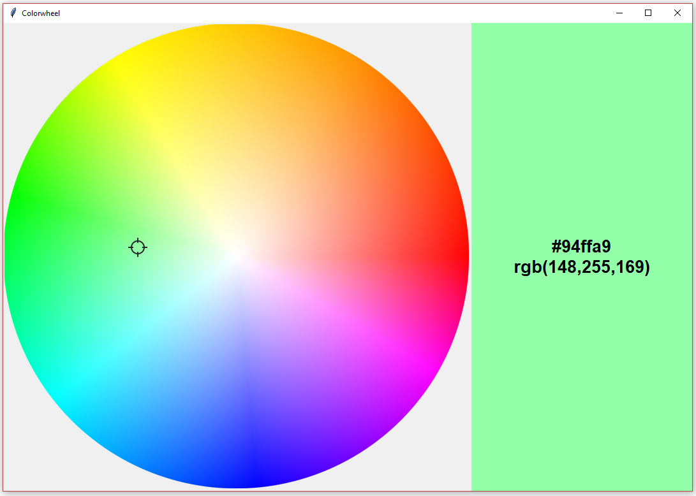

# Color-Wheel

 A colorwheel selector demo tool built with Tkinter

## 環境構築

Python標準ライブラリである[tkinter](https://docs.python.org/ja/3/library/tkinter.html)を使用しています。

[tkinter](https://docs.python.org/ja/3/library/tkinter.html)は `Tcl/Tk` を利用したライブラリのため、
`Tcl/Tk`ライブラリを有効化してビルドしたPythonを利用する必要があります。

お使いのPythonが`Tcl/Tk`に対応しているか確認するには以下を実行してください。
エラーが発生すれば`Tcl/Tk`に未対応です。`Tcl/Tk`対応版のPythonを入手してください。([参照: `Tcl/Tk`対応版 Pythonのビルド方法](#tcltk対応版-pythonのビルド方法))

新しい画面が表示され、`Tcl/Tk`のバージョンが表示されたら`Tcl/Tk`に対応しています。

~~~shell
python3 -m tkinter
~~~

また、本プロジェクトはパッケージ管理に[poetry](https://python-poetry.org/)を利用しています。
事前にpoetryを[インストール](https://python-poetry.org/docs/#installation)してください。

以下の実行し、必要なパッケージをインストールしてください。

~~~shell
poetry install
~~~

## 使い方

以下を実行すると、カラーホイール画面が表示されます。

~~~shell
poetry run python3 color_wheel.py
~~~

照準型のカーソルをドラッグすると該当箇所の色情報を右側の領域に表示します。

## `Tcl/Tk`対応版 Pythonのビルド方法

私の環境では`python3 -m tkinter`を実行するとエラーが発生しました。

~~~shell
$ poetry run python3 -m tkinter
Traceback (most recent call last):
  File "/usr/local/Cellar/python@3.9/3.9.13_1/Frameworks/Python.framework/Versions/3.9/lib/python3.9/runpy.py", line 188, in _run_module_as_main
    mod_name, mod_spec, code = _get_module_details(mod_name, _Error)
  File "/usr/local/Cellar/python@3.9/3.9.13_1/Frameworks/Python.framework/Versions/3.9/lib/python3.9/runpy.py", line 147, in _get_module_details
    return _get_module_details(pkg_main_name, error)
  File "/usr/local/Cellar/python@3.9/3.9.13_1/Frameworks/Python.framework/Versions/3.9/lib/python3.9/runpy.py", line 111, in _get_module_details
    __import__(pkg_name)
  File "/usr/local/Cellar/python@3.9/3.9.13_1/Frameworks/Python.framework/Versions/3.9/lib/python3.9/tkinter/__init__.py", line 37, in <module>
    import _tkinter # If this fails your Python may not be configured for Tk
ModuleNotFoundError: No module named '_tkinter'
~~~

私の環境であるMacOSでのビルド方法を説明します。[Homebrew](https://brew.sh/index_ja)と[pyenv](https://github.com/pyenv/pyenv)の利用を前提としています。

ビルド手順は以下になります。

1. Tcl/Tkのインストール

   ~~~shell
   brew install tcl-tk
   ~~~

2. Tcl/Tkのバージョンを確認

   ~~~shell
   $ brew show tcl-tk
   tcl-tk: stable 8.6.12 (bottled) [keg-only]
   Tool Command Language
   https://www.tcl-lang.org
   /usr/local/Cellar/tcl-tk/8.6.12_1 (3,045 files, 51.8MB)
   # ..略..
   ~~~

3. `tcl-tk` と一緒に python をビルド(今回は3.10.5)

   環境変数PYTHON_CONFIGURE_OPTSを付きでpythonをビルドします。
   ~~~shell
   PYTHON_CONFIGURE_OPTS="--with-tcltk-includes='-I/usr/local/opt/tcl-tk/include' --with-tcltk-libs='-L/usr/local/opt/tcl-tk/lib -ltcl8.6 -ltk8.6'" pyenv install 3.10.5
   ~~~

4. `poetry`の仮想環境にビルドしたTcl/TkT対応のPythonを指定

   ~~~shell
   pyenv local 3.10.5
   poetry env use $(pyenv which python3)
   ~~~

5. `tkinter`の動作確認

    ~~~shell
    poetry run python3 -m tkinter
    ~~~
